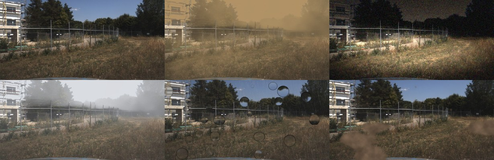

# Off-road segmentation stress test

**Find out which conditions break your off-road perception model, and how badly — in about ten minutes.**

165 labelled frames: 10 real off-road scenes rendered under **dust, night, fog, rain on the lens and mud on the lens**
at three severities each, plus 5 **real** rain and snow frames. Run your model over them, run `evaluate.py`, and you
get a failure map: mIoU per condition and severity, the drop against clear weather, traversable-ground IoU, and the
classes that fail first.

This repository is the free sample of the [Siltframe stress-test pack](https://siltframe.com/stress-test).
Everything here — images, labels, the scoring script — is yours to use, including commercially.



**Run it in your browser, nothing to install:** [Kaggle notebook](https://www.kaggle.com/code/clappoxed/where-does-your-off-road-segmentation-model-break) — it scores a public segmentation model over all 165 frames in about seven seconds and prints the failure map. Copy it, swap in your model, done.

Also on [Hugging Face](https://huggingface.co/datasets/siltframe/siltframe-stress-test) and as a [Kaggle dataset](https://www.kaggle.com/datasets/clappoxed/off-road-segmentation-stress-test).

## Quick start

```bash
git clone https://github.com/egeizgi/siltframe-stress-test
cd siltframe-stress-test
pip install numpy pillow
```

Write one prediction PNG per image, at the same relative path, each pixel holding a class id from `classes.csv`:

```python
import csv, numpy as np
from pathlib import Path
from PIL import Image

for r in csv.DictReader(open("manifest.csv")):
    img = np.array(Image.open(r["image"]))
    pred_ids = your_model(img)                  # H x W array of class ids
    out = Path("pred") / Path(r["image"]).with_suffix(".png")
    out.parent.mkdir(parents=True, exist_ok=True)
    Image.fromarray(pred_ids.astype(np.uint8)).save(out)
```

```bash
python evaluate.py --pred pred
```

Different class set? Map yours onto the 19 in `classes.csv` (RELLIS-3D ontology). Fewer classes is fine — anything you
don't predict simply scores 0 and the mean is taken over the classes present in the labels.

## What the reference models do on these frames

Measured by the same `evaluate.py`, included under `baselines/`. Mean mIoU loss against clear weather:

| | clean mIoU | night | dust | rain on lens | fog | mud on lens |
|---|---:|---:|---:|---:|---:|---:|
| SegFormer-B0 (RELLIS-3D only) | 14.5 | −69% | −43% | −23% | −23% | −10% |
| SegFormer-B0 (+ GOOSE) | 52.5 | −61% | −43% | −41% | −20% | −20% |
| Mask2Former Swin-T (+ GOOSE) | 58.1 | −56% | −35% | −41% | −16% | −19% |

Two things worth noticing, and they are the reason this test exists:

**Night is the universal failure.** All three reference models above lose more than half their mIoU; across the five
architectures on our [benchmark](https://siltframe.com/benchmark) — a separate protocol on RELLIS-3D — the loss is
37–64%, and none of them escapes it. If your validation set is daytime and dry, your number is not the number you
will get in the field.

**A model that scores badly can still be the robust one.** SegFormer-B0 trained on RELLIS-3D alone has the smallest
drop under rain and mud — because at 14.5 mIoU it had little left to lose. Relative drops have to be read next to the
clear-weather score, never alone.

## Why conditions, not just a single score

We ran this protocol across five architectures and found that **dataset coverage beats augmentation**. Adding real
frames from a dataset that contained forest tracks lifted real-adverse-weather accuracy by 26–35 points on all four
architectures we could run that comparison on, while weather augmentation on top of that coverage was within noise on
real weather. We traced one failure specifically: models
trained only on open terrain call overhead tree canopy "sky" — 80 % of tree pixels in one real forest-road frame.
Adding the right real frames took that to 0 %.

So the useful question is not "how robust is my model" but "**which condition is my data missing**". That is what a
failure map answers. The write-ups are at [siltframe.com/blog](https://siltframe.com/blog).

## The full pack

This sample is 10 scenes. The [full pack](https://siltframe.com/stress-test) is **2,460 labelled images** — 150 scenes
under the same 5 conditions × 3 severities, plus 60 real rain and snow frames, with reference results from three
models. One purchase, no subscription.

If you would rather have this run on **your** model and **your** footage, that is what we do:
[siltframe.com](https://siltframe.com).

## Licence and attribution

- **Images and labels**: [CC BY-SA 4.0](https://creativecommons.org/licenses/by-sa/4.0/). Derived from the
  [GOOSE dataset](https://goose-dataset.de) (Fraunhofer IOSB, CC BY-SA 4.0) — German outdoor and off-road scenes.
  Degradations and label mapping by Siltframe. Share-alike applies: if you redistribute these images or derivatives,
  keep them under CC BY-SA 4.0 and keep the attribution.
- **`evaluate.py`**: MIT.

The frames come from the GOOSE **validation** split, which none of the reference models was trained on.
